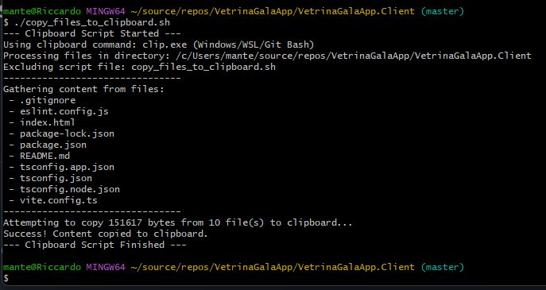

 

# Copy Files Content to Clipboard Script (`copy_files_to_clipboard.sh`)

## Purpose

This Bash script concatenates the text content of all regular files within the directory where it is executed and copies the combined text into your system's clipboard.

It's useful for quickly grabbing the source code of multiple small files, configuration data, notes, etc., from a single directory without manually opening and copying each one.

## Features

*   **Current Directory Only:** Processes files only in the directory where the script is run (`./`). It does not recurse into subdirectories.
*   **Copies All Regular Files:** It attempts to read and copy *any* regular file (e.g., `.txt`, `.sh`, `.py`, `.cs`, `.js`, `.json`, `.md`, configuration files, files with no extension), not just specific types. Binary files will likely result in garbled text in the clipboard.
*   **Excludes Itself:** The script automatically excludes its own file (`copy_files_to_clipboard.sh`) from being copied.
*   **Cross-Platform Clipboard:** Attempts to automatically detect and use the correct clipboard utility for your environment:
    *   `pbcopy` (macOS)
    *   `wl-copy` (Linux with Wayland)
    *   `xclip` (Linux with X11)
    *   `clip.exe` (Windows via WSL, Git Bash, Cygwin - attempts `unix2dos` for correct line endings)
*   **Feedback:** Prints information about the process, including the detected clipboard command, the directory being processed, files found, total bytes copied, and success/error status.

## Requirements

1.  **Bash:** A Bash-compatible shell is needed to run the script. This is standard on most Linux distributions and macOS. On Windows, you need an environment like:
    *   **WSL (Windows Subsystem for Linux):** Recommended.
    *   **Git Bash:** Included with Git for Windows.
    *   Cygwin.
2.  **Clipboard Utility:** Your system needs one of the supported clipboard command-line tools installed and accessible in your `PATH`:
    *   **macOS:** `pbcopy` is built-in.
    *   **Linux (Wayland):** Install the `wl-clipboard` package (e.g., `sudo apt install wl-clipboard` or `sudo dnf install wl-clipboard`).
    *   **Linux (X11):** Install the `xclip` package (e.g., `sudo apt install xclip` or `sudo dnf install xclip`). You also need a running X server session (`$DISPLAY` environment variable must be set).
    *   **Windows (via WSL/Git Bash):** `clip.exe` should be available by default. The script also tries to use `unix2dos` (from the `dos2unix` package, e.g., `sudo apt install dos2unix`) for better compatibility with Windows pasting – install it for best results.

## Installation / Setup

1.  **Save the Script:** Save the script code into a file named `copy_files_to_clipboard.sh` in a known location (e.g., your Downloads folder or a dedicated scripts folder).

2.  **Navigate to Target Directory (in Terminal):**
    Before copying the script or running it, you need to be *inside* the directory whose files you want to copy using your terminal. Use the `cd` (Change Directory) command.

    **Replace `/path/to/your/target/directory` with the actual path.**

    *   **If using WSL (Windows Subsystem for Linux):**
        ```bash
        # Example: cd /mnt/c/Users/YourUser/projects/my_code
        cd /path/to/your/target/directory
        ```
        *(Note: WSL typically mounts Windows drives under `/mnt/`, e.g., `C:\` becomes `/mnt/c/`)*

    *   **If using Git Bash (MINGW64):**
        ```bash
        # Example: cd /c/Users/YourUser/projects/my_code
        cd /path/to/your/target/directory
        ```
        *(Note: Git Bash typically mounts Windows drives directly, e.g., `C:\` becomes `/c/`)*

3.  **Place the Script in the Target Directory:**
    You need the `copy_files_to_clipboard.sh` file to be *inside* the directory you just navigated to.

    **Method A: Copy using the Terminal (Recommended)**

    While you are inside your target directory (from Step 2), use the `cp` (copy) command.

    **Replace `/path/where/you/saved/copy_files_to_clipboard.sh` with the actual path where you initially saved the script in Step 1.**

    ```bash
    # Example using WSL path: cp /mnt/c/Users/YourUser/Downloads/copy_files_to_clipboard.sh .
    # Example using Git Bash path: cp /c/Users/YourUser/Downloads/copy_files_to_clipboard.sh .

    cp /path/where/you/saved/copy_files_to_clipboard.sh .
    ```
    *   `cp`: The copy command.
    *   `/path/where/you/saved/copy_files_to_clipboard.sh`: The full path to the original script file.
    *   `.` : A shorthand for the current directory (your target directory).

    **Method B: Use File Explorer**

    You can open the current directory in your graphical file explorer:
    *   **From WSL:** Run `explorer.exe .`
    *   **From Git Bash:** Run `explorer .`
    Then, manually drag-and-drop or copy-paste the `copy_files_to_clipboard.sh` file from its original location into the window that opens.

4.  **Make Executable (Linux / macOS / WSL / Git Bash):**
    *Once the script is copied into your target directory*, make it executable. While still in the target directory in your terminal, run:
    ```bash
    chmod +x copy_files_to_clipboard.sh
    ```
    *   *Note:* This command grants the operating system permission to execute the file as a program. **This command will NOT work directly in Windows Command Prompt or PowerShell.** You must run it within WSL or Git Bash.

5.  **Add Script to `.gitignore` (Optional, Recommended for Projects):**
    If the target directory is part of a Git repository, you likely don't want to commit this helper script. Add its name to your repository's `.gitignore` file (usually located at the root of your project).

    Open the `.gitignore` file and add these lines:

    ```gitignore
    # Utility script - copies file contents to clipboard
    copy_files_to_clipboard.sh
    ```

## Usage

1.  **Ensure Setup is Done:** Make sure you have navigated to the target directory, copied the script into it, and made it executable (Steps 2-4 above).
2.  **Run:** Execute the script from within that target directory:
    ```bash
    ./copy_files_to_clipboard.sh
    ```
3.  **Check Output:** The script will print messages indicating which clipboard tool it's using, which files it's processing, and whether it succeeded.
4.  **Paste:** The combined text content of the files (excluding the script itself) is now in your clipboard. Go to your desired application (text editor, document, etc.) and paste the content (usually `Ctrl+V` on Windows/Linux, `Cmd+V` on macOS).

## How it Works (Briefly)

1.  Detects the system's clipboard command.
2.  Gets its own filename to avoid copying itself.
3.  Uses the `find` command to locate all *regular files* (`-type f`) in the *current directory only* (`-maxdepth 1`), excluding itself (`! -name SCRIPT_NAME`).
4.  Creates a temporary file.
5.  Appends the content of each found file (`cat {}`) to the temporary file.
6.  Checks if any content was gathered.
7.  If content exists, it pipes (`|`) the content from the temporary file (`cat $TEMP_CONTENT_FILE`) to the detected clipboard command (`pbcopy`, `wl-copy`, `xclip`, or `clip.exe`).
8.  Removes the temporary file upon completion or exit.

## Troubleshooting

*   **`cd: /path/to/directory: No such file or directory`**: Check your path carefully. Remember the difference between WSL (`/mnt/c/...`) and Git Bash (`/c/...`). Ensure the directory actually exists.
*   **`cp: cannot stat '/path/to/script.sh': No such file or directory`**: The path you provided as the *source* for the `cp` command is incorrect. Double-check where you originally saved the script.
*   **`./copy_files_to_clipboard.sh: Command not found`**: You are likely not in the same directory as the script, or you forgot the leading `./`. Make sure you `cd` into the correct directory first (Step 2).
*   **`./copy_files_to_clipboard.sh: Permission denied`**: You forgot to make the script executable after copying it. Run `chmod +x copy_files_to_clipboard.sh` (in WSL/Git Bash/Linux/macOS) while in the target directory (Step 4).
*   **`Error: No suitable clipboard command found...`**: You need to install one of the required clipboard utilities (`wl-clipboard`, `xclip`) or ensure you're running in an environment where one is available (macOS, WSL/Git Bash).
*   **`No other regular files found...`**: This means that besides the script file itself, there were no other *regular files* in the directory, or the files found were empty or unreadable. Remember, it doesn't look inside subdirectories.
*   **Running on Windows:** You cannot run this script directly in standard Windows Command Prompt (`cmd.exe`) or PowerShell. You **must** use a Bash environment like WSL or Git Bash.
*   **Incorrect Line Endings on Windows Paste:** If pasting into a Windows application (like Notepad) shows strange formatting or lines run together, ensure the `dos2unix` package (which includes `unix2dos`) is installed in your WSL/Git Bash environment. The script attempts to use it automatically if found.